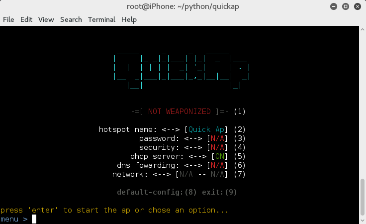

# QuickAp

QuickAp is a script that allow you to make a wifi hotspot quickly. You can choose different option and different
attack based on your security testing need.

## Platform

Currently the script is being developed for `kali-linux 2.0.` There is no guarantee that QuickAp will work in older version of kali
linux or in other distribution at the moment. More support will be added in the next version of the script.

## Installation

Clone the repository `git clone` https://github.com/blackice5514/QuickAp.git. Quick ap will need python3 to run. To check if python3
is installed on your system run the command `python3 -V`.

To launch the script run the following command in the main directory `python3 quick_ap.py`. QuickAp will install the missing dependency automatically.

## Usage



## Main menu

```
1) Let you choose the attack that you want to use. (attack will be added further into development.)

2) Let you choose the name of your wifi hotspot.

3) if a security has been chosen you will be able to change the password in this menu.

4) Let you choose the security protection that you want to use with the access point. (wpa/wpa2/wep)

5) Let you turn on/off the dnsmasq dhcp service if you want to use an other dhcp server.

6) Let you turn on/off the dnsmasq dns service. When dns fowarding is set to 'on' dnsmasq will be configured to 
   foward all the dns request to the google dns server (8.8.8.8). In this menu you also have the option to add a
   'A' record entry in the host file of dnsmasq for redirecting the client on the ip address of your choice.

7) Let you choose the interface for creating the wifi hotspot and the interface for sharing the internet with
   the client.
   
8) Restoring the default configuration of Quick ap.

9) Quitting QickAp and saving the configuration. (ctrl + c can also be use.)
```
## Project Status
For now the project is at is infancy. A lot of feature will be added when I will have the time. Here are the options I want to add to the project.
- sniffing. 
- captive portal.
- auto injecting beef hook in none secure browser connections.
- wifi passphrase capture with phishing.
- and more...

## Disclaimer
Usage of QuickAp for attacking infrastructures without prior mutual consistency can be considered as an illegal activity. It is the final user's responsibility to obey all applicable local, state and federal laws. Authors assume no liability and are not responsible for any misuse or damage caused by this program.

